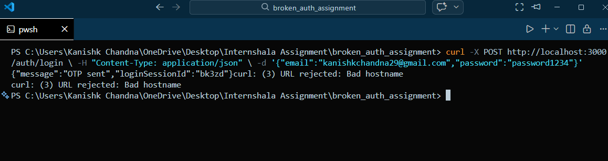
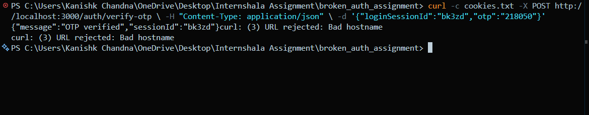
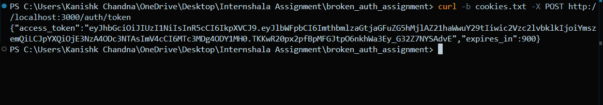
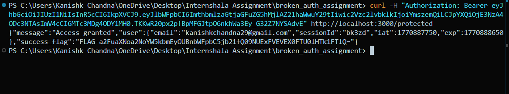
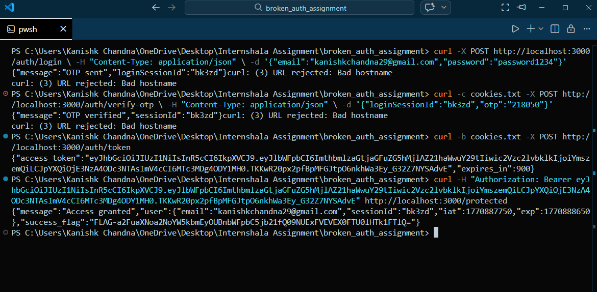

# Broken Authentication Assignment - Submission

## Introduction
This submission documents the debugging and fixing of the broken authentication flow in "The Silent Server" API. All four tasks have been successfully completed, allowing users to login, verify OTP, obtain JWT tokens, and access protected routes.

---

## Bugs Found and Fixes

### Task 1: Fix Login Endpoint
**Bug Found:** The logger middleware was not calling `next()`, blocking the request flow. Additionally, the OTP was not being logged to the console.

**Fix Applied:** 
- Added `next()` in the logger middleware to allow request to proceed
- Added console log to display the generated OTP for debugging

**Screenshot:**


---

### Task 2: Fix OTP Verification
**Bug Found:** The application was not using `cookieParser()` middleware, preventing proper cookie handling.

**Fix Applied:**
- Added `cookieParser()` as middleware in the application
- This enabled proper cookie parsing and setting for session management

**Screenshot:**


---

### Task 3: Fix Token Generation
**Bug Found:** The endpoint was attempting to read `session_token` from headers instead of cookies.

**Fix Applied:**
- Changed to read `session_token` from `req.cookies` instead of `req.headers`
- This allowed proper session retrieval for JWT generation

**Screenshot:**


---

### Task 4: Fix Protected Route Access
**Bug Found:** The auth middleware was not calling `next()` after successful token verification, blocking access to protected routes.

**Fix Applied:**
- Added `next()` in the auth.js middleware file after successful JWT verification
- This allowed the request to proceed to the protected route handler

**Screenshot:**


---

## Complete Authentication Flow
The following screenshot shows the entire authentication flow working successfully:



---

## Success Flag
```
FLAG-a2FuaXNoa2NoYW5kbmEyOUBnbWFpbC5jb21fQ09NUExFVEVEX0FTU0lHTk1FTlQ=
```

---

## Testing Results
All tasks completed successfully:
- ✅ Task 1: Login generates OTP and returns loginSessionId
- ✅ Task 2: OTP verification creates session cookie
- ✅ Task 3: Session exchange returns valid JWT access token
- ✅ Task 4: Protected route accessible with JWT, returning success flag

---

## Conclusion
The authentication system now works as intended, with a complete flow from login through OTP verification, token generation, and protected resource access. All security measures are properly implemented including session management, JWT tokens, and bearer token authentication.
